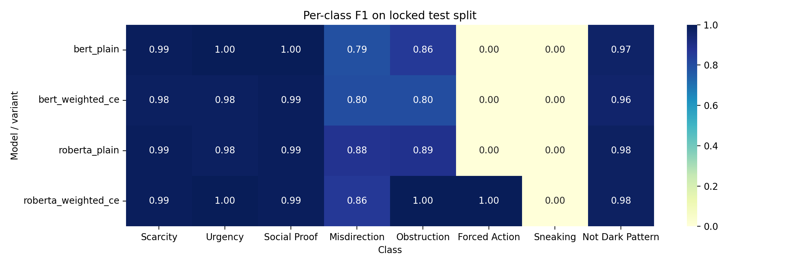
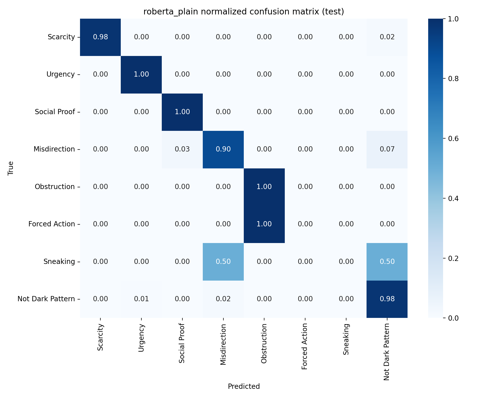
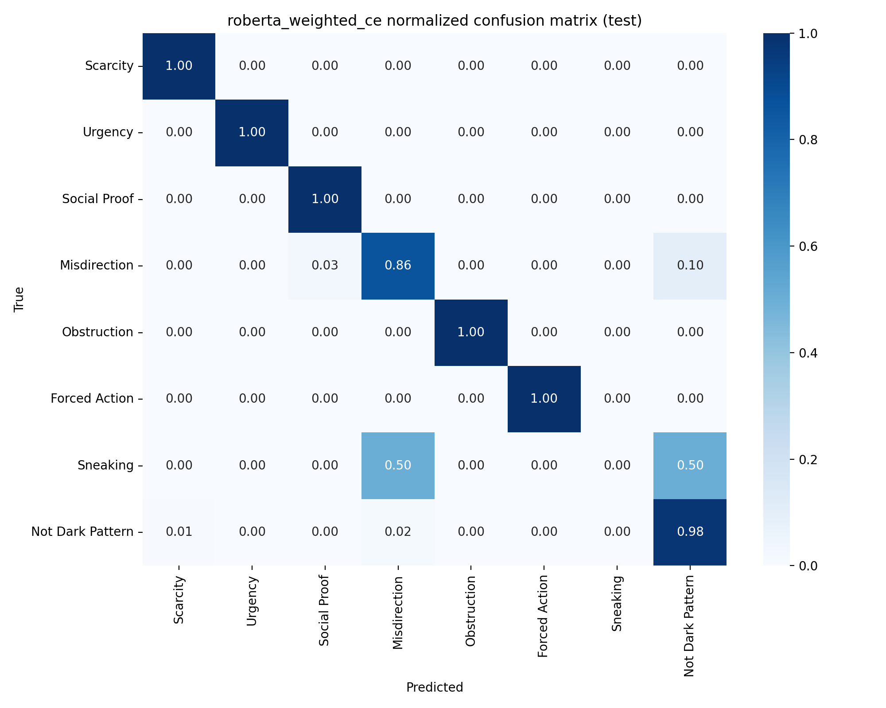
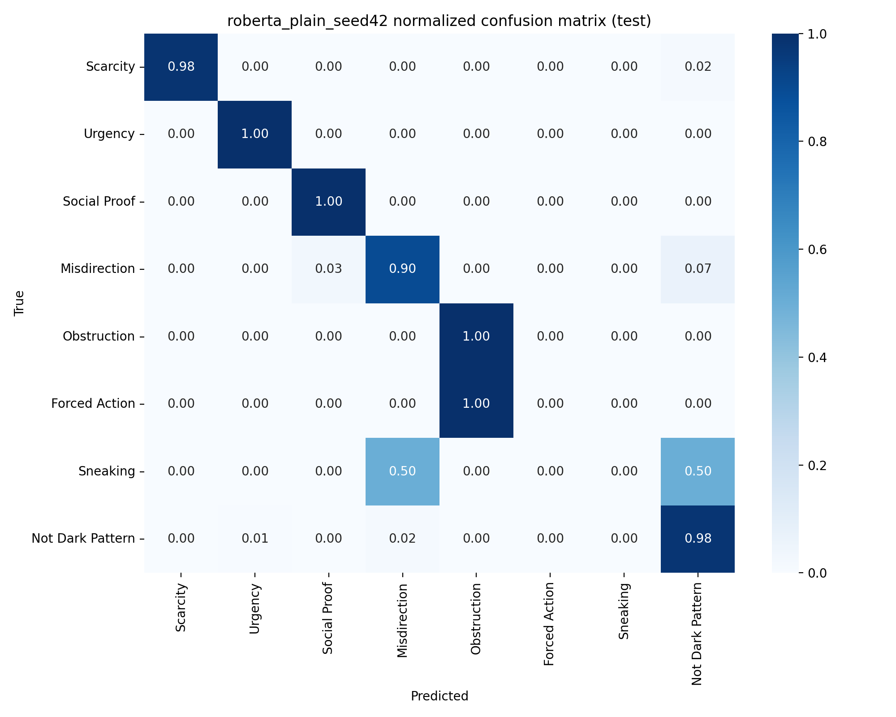
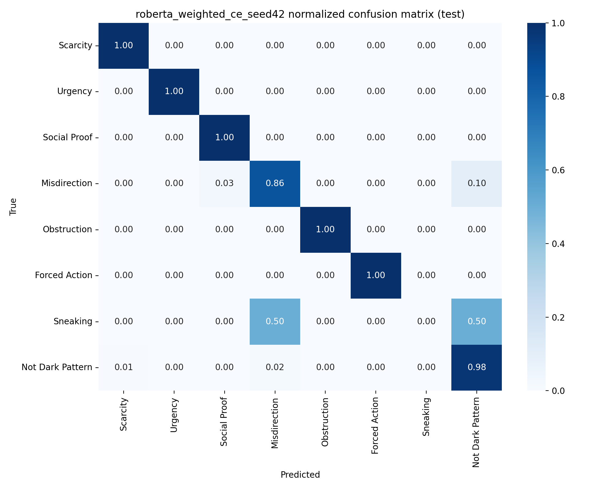

# Comprehensive Project Report

Generated from repo artifacts on branch `phase2-rag` at commit `500e24f`.

## 1. Executive Summary

This repository was turned from a partial research scaffold into a working HCNLP pipeline for:

1. dark pattern classification on e-commerce text
2. structured LLM explanation generation
3. controlled prompting comparisons across zero-shot, random few-shot, and retrieval-augmented prompting

The main concrete outcomes so far are:

- Phase 1 was stabilized around a canonical EC-DarkPattern dataset path, audited preprocessing, and a locked split.
- Phase 1 baselines were reproduced on that locked split with BERT and RoBERTa.
- Phase 1b added a minimal imbalance-aware ablation using class-weighted cross-entropy only.
- Phase 1c checked whether the weighted RoBERTa gain was stable across seeds.
- Phase 2A, 2B, and 2C were implemented as working pipelines for zero-shot, random few-shot, and RAG sanity runs on the locked validation split.

The strongest classification finding so far is:

- `roberta_weighted_ce` is the best single-seed baseline on the locked split.
- That gain is promising but fragile because `Forced Action` has test support `1` and `Sneaking` has test support `2`.

The strongest pipeline implementation finding so far is:

- zero-shot, random few-shot, and RAG all produced valid structured outputs on small locked-validation sanity slices with `qwen3:latest`
- RAG retrieval integrity was verified as train-only against the locked split

## 2. What We Changed

### Phase 1: Stabilization and Reproducibility

We normalized the repo around one canonical dataset path and one reproducible split workflow.

Key work:

- made `config.yaml` real configuration instead of dead documentation
- added canonical raw data location:
  - `data/raw/ec_darkpattern/dataset.tsv`
- preserved `data/dataset_repo/` as upstream reference material only
- generated audited processed outputs under:
  - `data/processed/ec_darkpattern/`
- added:
  - raw-data audit
  - split manifest
  - deterministic split generation
  - split validation
- aligned baselines and retrieval indexing to shared configured paths
- added Windows-first workflow support

### Phase 1b: Imbalance-Aware Baselines

We added the smallest honest imbalance intervention:

- class-weighted cross-entropy only

Deliberately not added:

- weighted sampling
- focal loss
- class-balanced loss
- augmentation
- synthetic resampling

### Phase 1c: Seed Robustness

We checked whether the weighted RoBERTa gain was stable or just a one-seed artifact using seeds:

- `7`
- `13`
- `42`

### Phase 2: Prompting Pipelines

We then implemented staged prompting pipelines using the same structured schema:

- zero-shot
- random few-shot
- RAG

Important conceptual boundary preserved throughout:

- zero-shot does not use retrieval
- random few-shot does not use retrieval
- only RAG uses retrieval

## 3. Dataset and Locked Split

### Raw Dataset Audit

The EC-DarkPattern dataset audit reported:

| Item | Value |
| --- | ---: |
| Total rows | 2356 |
| Mean characters | 43.21 |
| Median characters | 26 |
| Max characters | 857 |
| Mean tokens | 7.43 |
| Median tokens | 5 |
| Max tokens | 143 |

Raw label counts:

| Label | Count |
| --- | ---: |
| Not Dark Pattern | 1178 |
| Scarcity | 418 |
| Social Proof | 312 |
| Urgency | 210 |
| Misdirection | 195 |
| Obstruction | 27 |
| Sneaking | 12 |
| Forced Action | 4 |

Source artifacts:

- [raw_audit.json](data/processed/ec_darkpattern_phase1_locked/raw_audit.json)
- [split_manifest.json](data/processed/ec_darkpattern_phase1_locked/split_manifest.json)

### Locked Split

Accepted locked split root:

- `data/processed/ec_darkpattern_phase1_locked/`

Split sizes:

| Split | Rows |
| --- | ---: |
| Train | 1647 |
| Val | 355 |
| Test | 354 |

Per-class counts by split:

| Label | Train | Val | Test |
| --- | ---: | ---: | ---: |
| Not Dark Pattern | 824 | 177 | 177 |
| Scarcity | 292 | 63 | 63 |
| Social Proof | 218 | 47 | 47 |
| Urgency | 147 | 32 | 31 |
| Misdirection | 137 | 29 | 29 |
| Obstruction | 19 | 4 | 4 |
| Sneaking | 8 | 2 | 2 |
| Forced Action | 2 | 1 | 1 |

Why the split was accepted:

- every class present in raw data appears in train
- every class also appears in val and test
- the earlier zero-support `Forced Action` problem was removed

Why caution still remains:

- `Forced Action` has only `4` total examples and `1` test example
- `Sneaking` has only `12` total examples and `2` test examples

## 4. Frozen Phase 1 and Phase 1b Baseline Results

### Main Test-Set Comparison

| Model | Variant | Accuracy | Macro F1 | Weighted F1 | Minority Avg F1 | Forced Action F1 | Sneaking F1 |
| --- | --- | ---: | ---: | ---: | ---: | ---: | ---: |
| BERT | plain | 0.9605 | 0.7011 | 0.9550 | 0.2857 | 0.0000 | 0.0000 |
| BERT | weighted CE | 0.9520 | 0.6898 | 0.9477 | 0.2667 | 0.0000 | 0.0000 |
| RoBERTa | plain | 0.9689 | 0.7142 | 0.9650 | 0.2963 | 0.0000 | 0.0000 |
| RoBERTa | weighted CE | 0.9718 | 0.8526 | 0.9690 | 0.6667 | 1.0000 | 0.0000 |

Main interpretation:

- weighted BERT is worse than plain BERT
- weighted RoBERTa is stronger than plain RoBERTa on the locked split
- the weighted RoBERTa jump is driven heavily by the single `Forced Action` test example

Official artifact roots:

- plain baselines:
  - `outputs/models/bert/`
  - `outputs/models/roberta/`
  - `results/baselines/bert.json`
- weighted baselines:
  - `outputs/models_weighted/bert_weighted_ce/`
  - `outputs/models_weighted/roberta_weighted_ce/`
  - `results/baselines_weighted/bert_weighted_ce.json`
  - `results/baselines_weighted/roberta_weighted_ce.json`

Important artifact warning:

- `results/baselines/roberta.json` is stale and must not be treated as truth for the locked split

### Visuals: Phase 1b

Per-class F1 heatmap:

RoBERTa plain normalized confusion matrix:

RoBERTa weighted CE normalized confusion matrix:

## 5. Phase 1c Seed Robustness

The weighted RoBERTa result was checked across seeds `7`, `13`, and `42`.

### Seed-by-Seed Results

| Variant | Seed | Test Accuracy | Test Macro F1 | Test Weighted F1 | Minority Avg F1 | Forced Action F1 | Sneaking F1 |
| --- | ---: | ---: | ---: | ---: | ---: | ---: | ---: |
| plain | 7 | 0.9661 | 0.7092 | 0.9619 | 0.2963 | 0.0000 | 0.0000 |
| plain | 13 | 0.9774 | 0.8586 | 0.9746 | 0.6667 | 1.0000 | 0.0000 |
| plain | 42 | 0.9689 | 0.7142 | 0.9650 | 0.2963 | 0.0000 | 0.0000 |
| weighted CE | 7 | 0.9689 | 0.8497 | 0.9658 | 0.6667 | 1.0000 | 0.0000 |
| weighted CE | 13 | 0.9746 | 0.8543 | 0.9714 | 0.6667 | 1.0000 | 0.0000 |
| weighted CE | 42 | 0.9718 | 0.8526 | 0.9690 | 0.6667 | 1.0000 | 0.0000 |

### Aggregate Summary

| Variant | Accuracy Mean | Accuracy Std | Macro F1 Mean | Macro F1 Std | Weighted F1 Mean | Weighted F1 Std | Minority Avg F1 Mean | Minority Avg F1 Std |
| --- | ---: | ---: | ---: | ---: | ---: | ---: | ---: | ---: |
| plain | 0.9708 | 0.0059 | 0.7607 | 0.0849 | 0.9672 | 0.0066 | 0.4198 | 0.2138 |
| weighted CE | 0.9718 | 0.0028 | 0.8522 | 0.0024 | 0.9687 | 0.0028 | 0.6667 | 0.0000 |

Interpretation:

- weighted RoBERTa is more consistent than plain RoBERTa across the tested seeds
- weighted RoBERTa captures the single `Forced Action` test example in all three tested seeds
- `Sneaking` remains unresolved at `0.0` F1 across every tested run
- the result is best described as **fragile but promising**, not robust in a strong statistical sense

Representative seed-level visuals:

Seed 42 plain:

Seed 42 weighted CE:

## 6. Phase 2 Prompting Pipelines

All Phase 2 pipelines use the same structured schema:

- `label`
- `confidence`
- `psychological_mechanism`
- `evidence_span`
- `harm_dimension`
- `rationale`
- `rewrite`

All sanity runs were executed with the local Ollama default:

- `qwen3:latest`

### Phase 2A: Zero-Shot

Status:

- implemented
- operational
- retrieval-free by design

Small locked-validation sanity run:

| Metric | Value |
| --- | ---: |
| Processed items | 5 |
| JSON valid | 5 / 5 |
| Schema pass | 5 / 5 |
| Label in known set | 5 / 5 |
| Evidence span grounded | 5 / 5 |

Representative outputs:

- `Holland Cooper` -> `Not Dark Pattern`
- `MoTrail` -> `Not Dark Pattern`
- `Events and Entertainment` -> `Not Dark Pattern`

Artifacts:

- `results/predictions/zero_shot/`
- `results/analysis/phase2_zero_shot_sanity/`

### Phase 2B: Random Few-Shot

Status:

- implemented
- operational
- retrieval-free by design
- examples sampled only from locked train

Sanity run configuration:

- validation slice size: `5`
- example count: `3`
- seed: `42`

Sanity run results:

| Metric | Value |
| --- | ---: |
| Processed items | 5 |
| JSON valid | 5 / 5 |
| Schema pass | 5 / 5 |
| Label in known set | 5 / 5 |
| Evidence span grounded | 5 / 5 |

Representative findings:

- example sampling stayed inside `data/processed/ec_darkpattern_phase1_locked/train.csv`
- no retrieval imports or calls were used
- the pipeline produced valid structured outputs with sampled label-only references

Artifacts:

- `results/predictions/random_few_shot/`
- `results/analysis/phase2_random_few_shot_sanity/`

### Phase 2C: RAG

Status:

- implemented
- operational on sanity slice
- only Phase 2 pipeline allowed to use retrieval

Sanity run configuration:

- validation slice size: `5`
- encoder: `bert`
- retrieval strategy: `knn`
- top_k: `3`

Sanity run results:

| Metric | Value |
| --- | ---: |
| Processed items | 5 |
| JSON valid | 5 / 5 |
| Schema pass | 5 / 5 |
| Label in known set | 5 / 5 |
| Evidence span grounded | 5 / 5 |
| Retrieval source train-only | true |
| Val overlap count | 0 |
| Test overlap count | 0 |

Important retrieval integrity finding:

- the retrieval metadata matched the locked training split exactly
- retrieval candidates were verified against exact `(text, category)` tuples
- no locked validation or test rows appeared as retrieval candidates

Representative retrieved neighbors for:

- `HURRY! £32.99 UK DELIVERY ENDS SOON`

Top retrieved examples were:

1. `In Stock. Only 1 Left!` -> `Scarcity` (`0.9048`)
2. `Only 8 left in stock. Almost Gone!` -> `Scarcity` (`0.8988`)
3. `HURRY! ONLY 19 LEFT IN STOCK.` -> `Scarcity` (`0.8985`)

Important interpretation note:

- retrieved examples are **label-anchored references**, not gold explanation exemplars

Artifacts:

- `results/predictions/rag/`
- `results/analysis/phase2_rag_sanity/`

## 7. Visual Summary

### Best Phase 1b Overall View

### Best Baseline Comparison

Plain RoBERTa:

Weighted RoBERTa:

### Seed Robustness Snapshot

Weighted CE, seed 42:

## 8. What We Found

### Strong Findings

1. The repo is now a reproducible research scaffold rather than just a loose plan.
2. The locked split is scientifically more usable than the earlier untracked split because every class, including `Forced Action`, appears in test.
3. RoBERTa is consistently stronger than BERT on the locked split.
4. Weighted CE helps RoBERTa much more than BERT on this dataset.
5. Weighted RoBERTa looks directionally better and more stable than plain RoBERTa across the tested seeds.
6. The three prompting pipelines all produce valid structured outputs on small locked-validation sanity checks.
7. RAG retrieval integrity was explicitly verified as train-only.

### Fragile Findings

1. `Forced Action` remains too rare for strong claims.
2. `Sneaking` remains unresolved across all tested classifier variants.
3. The weighted RoBERTa gain should be interpreted with caution because one test example materially changes the minority-class story.
4. Phase 2 pipeline results so far are sanity checks only, not full evaluation studies.

### Known Artifact Caveat

- `results/baselines/roberta.json` is stale and should not be cited as the locked-split truth.

## 9. Frozen vs Experimental State

Frozen truth:

- locked split:
  - `data/processed/ec_darkpattern_phase1_locked/`
- frozen plain baselines:
  - `outputs/models/bert/`
  - `outputs/models/roberta/`
  - `results/baselines/bert.json`
- frozen weighted baselines:
  - `outputs/models_weighted/bert_weighted_ce/`
  - `outputs/models_weighted/roberta_weighted_ce/`
  - `results/baselines_weighted/`
- frozen analysis:
  - `results/analysis/phase1b/`
  - `results/analysis/phase1c_seed_robustness/`

Current experimental or branch-local work:

- Phase 2 prompting implementations and sanity artifacts
- current branch-local RAG changes on `phase2-rag`

## 10. Current Best Baseline and Current Best Pipeline Status

### Best Baseline

Current best single-seed baseline:

- `roberta_weighted_ce`

Why:

- best test accuracy among accepted Phase 1 / 1b baselines
- best test macro F1
- best minority average F1

Why this is not a final victory claim:

- the gain is still heavily influenced by `Forced Action` support `1`
- `Sneaking` remains at `0.0` F1

### Best Pipeline Status

All three prompting modes now exist and pass small sanity checks:

- zero-shot: working
- random few-shot: working
- RAG: working with train-only retrieval verification

This means the project has reached the point where explanation-oriented evaluation planning is now justified.

## 11. Recommended Next Steps

Recommended immediate next step:

1. freeze and commit the current Phase 2 pipeline implementations cleanly
2. plan explanation evaluation before broadening scope
3. define the minimum evaluation frame for:
   - label correctness
   - evidence-span grounding
   - rationale usefulness
   - rewrite quality
4. then decide whether to run full-split inference for zero-shot, random few-shot, and RAG

Recommended caution:

- continue to report rare-class caveats prominently
- avoid overstating minority-class improvements
- keep zero-shot and random few-shot retrieval-free
- keep RAG as the only retrieval-enabled pipeline

## 12. Artifact Map

Core state files:

- [AGENTS.md](AGENTS.md)
- [README.md](README.md)
- [PROJECT_STATE/PHASE1_STATUS.md](PROJECT_STATE/PHASE1_STATUS.md)
- [PROJECT_STATE/PHASE1B_STATUS.md](PROJECT_STATE/PHASE1B_STATUS.md)
- [PROJECT_STATE/FROZEN_ARTIFACTS.md](PROJECT_STATE/FROZEN_ARTIFACTS.md)
- [PROJECT_STATE/NEXT_STEP.md](PROJECT_STATE/NEXT_STEP.md)

Main analysis roots:

- [results/analysis/phase1b](results/analysis/phase1b)
- [results/analysis/phase1c_seed_robustness](results/analysis/phase1c_seed_robustness)
- [results/analysis/phase2_zero_shot_sanity](results/analysis/phase2_zero_shot_sanity)
- [results/analysis/phase2_random_few_shot_sanity](results/analysis/phase2_random_few_shot_sanity)
- [results/analysis/phase2_rag_sanity](results/analysis/phase2_rag_sanity)

Prediction roots:

- [results/predictions/zero_shot](results/predictions/zero_shot)
- [results/predictions/random_few_shot](results/predictions/random_few_shot)
- [results/predictions/rag](results/predictions/rag)

## 13. Bottom Line

This project now has:

- a reproducible locked-split classification foundation
- a minimal imbalance ablation with a clear outcome
- a seed-robustness check with honest caveats
- working zero-shot, random few-shot, and RAG pipelines
- train-only verified retrieval for the RAG branch

The repo has moved from setup and stabilization into genuine experimentation.
The next step is no longer infrastructure repair. The next step is disciplined explanation evaluation.
